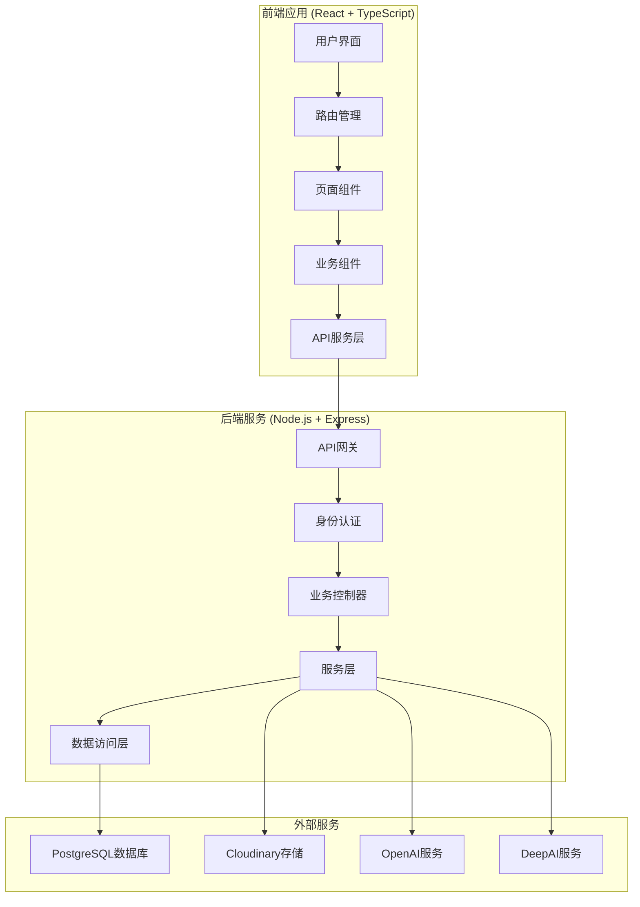

# WeFrame - 智慧头像装饰器(前端文档)

[](https://opensource.org/licenses/MIT)
[](https://reactjs.org/)
[](https://www.typescriptlang.org/)
[](https://nodejs.org/)
[](https://www.postgresql.org/)

一个基于 **React + TypeScript + Node.js** 开发的全栈智慧头像装饰器，集成多种AI图像处理技术，为用户提供专业级的头像美化和个性化定制服务。

## 🌟 项目特色

### 🔥 技术创新
- **前沿AI集成**: 集成OpenAI、DeepAI等多个AI服务，提供超分辨率、风格迁移、文生图等功能
- **实时图像处理**: 基于Canvas + Fabric.js的高性能前端图像处理引擎
- **现代化架构**: 采用React 18 + TypeScript + Vite的现代前端架构
- **微服务设计**: 后端采用模块化设计，支持横向扩展

### 🎨 功能丰富
- **10+核心功能**: 涵盖头像框装饰、AI处理、风格转换等全方位需求
- **智能化处理**: AI自动识别人像，智能背景处理和风格迁移
- **个性化定制**: 支持自定义头像框上传和动态特效制作
- **版权保护**: 内置水印和版权保护机制

### 💎 用户体验
- **Glassmorphism设计**: 采用流行的玻璃态设计风格，视觉效果出众
- **响应式布局**: 完美适配桌面端和移动端
- **实时预览**: 所有处理效果都支持实时预览
- **一键分享**: 无缝对接微信等社交平台

## 🚀 核心功能

### 高优先级功能 (已实现)
1. **🖼️ 预设头像框** - 丰富的节日主题和专业设计头像框
2. **📤 自定义头像框上传** - 支持用户上传PNG透明头像框
3. **🔍 头像超分处理** - AI智能提升头像清晰度和分辨率
4. **🎨 艺术风格迁移** - 梵高、莫奈等经典艺术风格转换
5. **✨ 文生图头像生成** - 通过文字描述AI生成个性化头像
6. **🌟 动态特效头像** - 粒子、光影等动态特效制作
7. **🔒 头像版权保护** - 水印和版权信息保护
8. **📷 人像背景虚化** - AI智能人像识别和背景处理
9. **📖 AI处理历史** - 完整的处理记录和管理
10. **👤 用户认证系统** - 安全的用户登录注册机制

## 🛠️ 技术栈

### 前端技术栈
```javascript
{
  "框架": "React 18.2.0 + TypeScript 4.9.0",
  "构建工具": "Vite 4.1.0",
  "UI组件库": "Ant Design 5.2.0",
  "路由管理": "React Router DOM 6.8.0",
  "图像处理": "Fabric.js 5.2.0 + HTML5 Canvas",
  "动画效果": "Framer Motion 9.0.0",
  "HTTP客户端": "Axios 1.3.0",
  "文件处理": "FileSaver.js + html2canvas",
  "样式方案": "Styled Components + CSS Modules"
}
```

### 后端技术栈
```javascript
{
  "运行环境": "Node.js 16.0+",
  "Web框架": "Express 4.18.2",
  "数据库": "PostgreSQL 12.0+",
  "ORM工具": "原生SQL + pg驱动",
  "身份认证": "JWT + bcryptjs",
  "文件存储": "Cloudinary云存储",
  "AI服务": "OpenAI GPT + DeepAI",
  "图像处理": "Sharp 0.32.6",
  "安全中间件": "CORS + Express Rate Limit"
}
```

### 开发工具
```javascript
{
  "包管理": "npm",
  "代码规范": "ESLint + TypeScript ESLint",
  "类型检查": "TypeScript",
  "API文档": "详细的Markdown文档",
  "版本控制": "Git + GitHub"
}
```

## 📦 快速开始

### 📋 环境要求
- **Node.js** >= 16.0.0
- **PostgreSQL** >= 12.0
- **npm** >= 8.0.0
- **Git** (用于克隆项目)

### 🔧 1. 项目克隆
```bash
git clone https://github.com/your-username/weframe-avatar-decorator.git
cd weframe-avatar-decorator
```

### 🗄️ 2. 数据库配置

#### Windows系统
1. 下载并安装 [PostgreSQL](https://www.postgresql.org/download/windows/)
2. 安装时设置超级用户密码（推荐使用 `1`）
3. 确保PostgreSQL服务启动

#### macOS系统
```bash
# 使用Homebrew安装
brew install postgresql
brew services start postgresql
```

#### Linux系统 (Ubuntu/Debian)
```bash
sudo apt update
sudo apt install postgresql postgresql-contrib
sudo systemctl start postgresql
sudo systemctl enable postgresql
```

### ⚙️ 3. 后端环境配置

```bash
# 进入后端目录
cd weframe-backend

# 安装依赖
npm install

# 复制环境变量配置文件
cp .env.example .env
```

编辑 `.env` 文件：
```properties
# 数据库配置
DB_USER=postgres
DB_HOST=localhost
DB_NAME=weframe
DB_PASSWORD=1
DB_PORT=5432

# 服务器配置
PORT=3000
JWT_SECRET=your-secret-key-here

# Cloudinary配置 (图片存储)
CLOUDINARY_CLOUD_NAME=your-cloud-name
CLOUDINARY_API_KEY=your-api-key
CLOUDINARY_API_SECRET=your-api-secret

# AI服务配置
DEEPAI_API_KEY=your-deepai-key
OPENAI_API_KEY=your-openai-key
OPENAI_API_BASE_URL=https://api.openai.com/v1
```

### 🗃️ 4. 数据库初始化

```bash
# 在 weframe-backend 目录下执行

# 1. 测试数据库连接
npm run test-connection

# 2. 一键完整设置（推荐）
npm run setup-full

# 或者分步执行：
# npm run create-db    # 创建数据库
# npm run init-db      # 初始化表结构和数据
# npm run test-db      # 验证数据库设置
```

### 🚀 5. 启动服务

#### 启动后端服务
```bash
# 在 weframe-backend 目录下
npm run dev
# 或生产模式: npm start
```
后端服务将在 `http://localhost:3000` 启动

#### 启动前端服务
```bash
# 在项目根目录下
npm install
npm run dev
```
前端应用将在 `http://localhost:8080` 启动

### 🎉 6. 访问应用

打开浏览器访问 `http://localhost:8080`，即可开始使用WeFrame系统！

## 📁 项目架构

### 📂 整体目录结构
```
Avatar-Frame-Decorator/
├── 📁 src/                          # 前端源代码
│   ├── 📁 components/               # 可复用组件
│   │   └── AvatarUpload.tsx         # 头像上传组件
│   ├── 📁 pages/                    # 页面组件
│   │   ├── Home.tsx                 # 首页
│   │   ├── PresetFrames.tsx         # 预设头像框
│   │   ├── CustomFrames.tsx         # 自定义头像框
│   │   ├── SuperResolution.tsx      # 头像超分处理
│   │   ├── StyleTransfer.tsx        # 艺术风格迁移
│   │   ├── TextToImage.tsx          # 文生图头像
│   │   ├── DynamicEffects.tsx       # 动态特效头像
│   │   ├── BackgroundBlur.tsx       # 人像背景虚化
│   │   ├── Copyright.tsx            # 头像版权保护
│   │   └── AIHistory.tsx            # AI处理历史
│   ├── 📁 services/                 # API服务层
│   ├── 📁 config/                   # 配置文件
│   ├── App.tsx                      # 主应用组件
│   ├── main.tsx                     # 应用入口
│   └── index.css                    # 全局样式
├── 📁 weframe-backend/              # 后端服务
│   ├── 📁 controllers/              # 控制器层
│   ├── 📁 routes/                   # 路由定义
│   ├── 📁 models/                   # 数据模型
│   ├── 📁 services/                 # 业务服务层
│   ├── 📁 middlewares/              # 中间件
│   ├── 📁 config/                   # 配置文件
│   ├── 📁 scripts/                  # 数据库脚本
│   ├── 📁 utils/                    # 工具函数
│   ├── 📁 workers/                  # 后台任务
│   ├── app.js                       # 应用入口
│   ├── schema-fixed.sql             # 数据库结构
│   └── package.json                 # 后端依赖
├── 📄 package.json                  # 前端依赖
├── 📄 vite.config.ts               # Vite配置
├── 📄 tsconfig.json                # TypeScript配置
├── 📄 后端API接口文档.md           # API文档
├── 📄 前后端接口集成指南.md       # 集成指南
└── 📄 README.md                    # 项目文档
```

### 🏗️ 系统架构图



## 🎯 功能详细说明

### 1. 🖼️ 预设头像框
- **丰富素材库**: 包含节日、商务、可爱、酷炫等多种分类
- **智能分类**: 支持按分类、标签筛选头像框
- **实时预览**: 拖拽头像即可实时查看效果
- **一键应用**: 点击即可应用到头像

### 2. 📤 自定义头像框上传
- **多格式支持**: 支持PNG、JPG、WebP格式
- **透明度处理**: 自动处理PNG透明背景
- **尺寸调整**: 智能调整头像框大小和位置
- **效果预览**: 上传后立即预览效果

### 3. 🔍 头像超分处理
- **AI算法**: 采用先进的超分辨率算法
- **多倍超分**: 支持2x、4x、8x超分辨率
- **质量对比**: 提供处理前后对比功能
- **批量处理**: 支持多张图片批量超分

### 4. 🎨 艺术风格迁移
- **经典风格**: 梵高、莫奈、毕加索等大师风格
- **现代风格**: 动漫、油画、水彩等现代艺术风格
- **强度控制**: 可调节风格迁移强度
- **高质量输出**: 保持原图清晰度的同时完成风格转换

### 5. ✨ 文生图头像生成
- **中文支持**: 支持中文描述输入
- **智能理解**: AI理解复杂的文字描述
- **多样化风格**: 真实、动漫、油画等多种生成风格
- **批量生成**: 一次描述生成多种变体

### 6. 🌟 动态特效头像
- **丰富特效**: 粒子飘落、星光闪烁、光晕流动等
- **参数调节**: 速度、密度、颜色等可调节
- **格式输出**: 支持GIF、MP4格式输出
- **循环设置**: 可设置无限循环播放

### 7. 📷 人像背景虚化
- **AI识别**: 智能识别人像和背景
- **自然虚化**: 专业级背景虚化效果
- **背景替换**: 支持纯色或图片背景替换
- **边缘优化**: 智能优化人像边缘效果

### 8. 🔒 头像版权保护
- **隐形水印**: 不影响视觉效果的水印技术
- **可见标识**: 可添加可见的版权标识
- **创作认证**: 支持创作者身份认证
- **盗用检测**: 提供版权验证工具

### 9. 📖 AI处理历史
- **完整记录**: 记录所有AI处理历史
- **快速重做**: 一键重新应用历史处理
- **收藏管理**: 可收藏喜欢的处理效果
- **批量导出**: 支持批量导出历史作品

## 🔧 开发指南

### 添加新功能模块

1. **创建页面组件**
```bash
# 在 src/pages/ 目录下创建新组件
touch src/pages/NewFeature.tsx
```

2. **更新路由配置**
```typescript
// 在 src/App.tsx 中添加路由
import NewFeature from './pages/NewFeature'

// 在路由配置中添加
<Route path="/new-feature" element={<NewFeature />} />
```

3. **更新菜单**
```typescript
// 在 App.tsx 的 menuItems 中添加
{ key: '/new-feature', icon: <NewIcon />, label: '新功能' }
```

### API接口开发

1. **创建路由文件**
```bash
# 在 weframe-backend/routes/ 目录下
touch weframe-backend/routes/newFeatureRoutes.js
```

2. **创建控制器**
```bash
# 在 weframe-backend/controllers/ 目录下
touch weframe-backend/controllers/newFeatureController.js
```

3. **注册路由**
```javascript
// 在 weframe-backend/app.js 中注册
const newFeatureRoutes = require('./routes/newFeatureRoutes');
app.use('/api/new-feature', newFeatureRoutes);
```

### 环境配置

#### 开发环境配置
```bash
# 前端开发配置
npm run dev          # 启动开发服务器
npm run lint         # 代码检查
npm run type-check   # 类型检查

# 后端开发配置
npm run dev          # 启动后端开发服务器
npm run test-db      # 测试数据库连接
```

#### 生产环境部署
```bash
# 前端构建
npm run build
npm run preview      # 预览构建结果

# 后端部署
npm start           # 生产模式启动
```

### 数据库操作

#### 常用脚本
```bash
# 数据库管理脚本
npm run test-connection    # 测试连接
npm run create-db         # 创建数据库
npm run init-db          # 初始化表结构
npm run test-db          # 验证设置
npm run update-frames    # 更新头像框数据
npm run setup-full       # 一键完整设置
```

#### 自定义数据库操作
```javascript
// 在 weframe-backend/scripts/ 目录下创建脚本
const db = require('../config/database');

async function customOperation() {
  // 自定义数据库操作
}
```

## 🔗 API接口说明

### 认证接口
```http
POST /auth/login      # 用户登录
POST /auth/register   # 用户注册
POST /auth/logout     # 用户登出
```

### 文件上传接口
```http
POST /upload/avatar   # 头像上传
POST /upload/frame    # 头像框上传
```

### 头像框接口
```http
GET /frames/preset    # 获取预设头像框
POST /frames/apply    # 应用头像框
POST /frames/custom   # 自定义头像框
```

### AI处理接口
```http
POST /ai/super-resolution  # 超分辨率处理
POST /ai/style-transfer   # 风格迁移
POST /ai/text-to-image    # 文生图
POST /ai/background-blur  # 背景虚化
```

### 分享接口
```http
GET /share/:id        # 获取分享内容
POST /share/create    # 创建分享链接
```

详细的API文档请参考：[后端API接口文档.md](./后端API接口文档.md)

## 🌐 浏览器支持

| 浏览器 | 最低版本要求 |
|--------|-------------|
| Chrome | >= 88 |
| Firefox | >= 85 |
| Safari | >= 14 |
| Edge | >= 88 |
| iOS Safari | >= 14 |
| Android Chrome | >= 88 |

## 🚧 性能优化

### 前端优化
- **组件懒加载**: 使用React.lazy()实现页面组件懒加载
- **图片压缩**: 自动压缩上传图片，减少传输时间
- **缓存策略**: 合理使用浏览器缓存和Service Worker
- **Bundle分割**: Vite自动进行代码分割优化

### 后端优化
- **数据库连接池**: 使用连接池管理数据库连接
- **请求限流**: 实现API请求频率限制
- **图片CDN**: 使用Cloudinary CDN加速图片加载
- **异步处理**: AI处理任务采用异步队列处理

### 部署优化
- **Docker容器化**: 支持Docker容器化部署
- **负载均衡**: 支持多实例负载均衡
- **监控告警**: 集成应用性能监控
- **自动扩容**: 支持基于负载的自动扩容

## 📊 监控和日志

### 应用监控
- **性能监控**: 监控接口响应时间和成功率
- **错误追踪**: 自动收集和分析错误信息
- **用户行为**: 统计用户使用功能的数据
- **资源使用**: 监控CPU、内存、磁盘使用情况

### 日志管理
- **结构化日志**: 使用JSON格式记录日志
- **日志分级**: DEBUG、INFO、WARN、ERROR四级日志
- **日志轮转**: 自动进行日志文件轮转和清理
- **集中管理**: 支持集中式日志管理系统

## 🔐 安全特性

### 数据安全
- **数据加密**: 敏感数据加密存储
- **SQL注入防护**: 使用参数化查询防止SQL注入
- **XSS防护**: 前端输入过滤和输出编码
- **CSRF防护**: 实现CSRF Token验证

### 访问控制
- **JWT认证**: 使用JWT进行用户身份认证
- **权限管理**: 基于角色的访问控制
- **请求限流**: 防止恶意请求和DDoS攻击
- **IP白名单**: 支持IP白名单访问控制

### 文件安全
- **文件类型检查**: 严格检查上传文件类型
- **文件大小限制**: 限制上传文件大小
- **病毒扫描**: 集成文件病毒扫描
- **安全存储**: 文件存储在安全的云服务

## 🧪 测试指南

### 前端测试
```bash
# 单元测试
npm run test

# 集成测试
npm run test:integration

# E2E测试
npm run test:e2e
```

### 后端测试
```bash
# API测试
npm run test:api

# 数据库测试
npm run test:db

# 性能测试
npm run test:performance
```

### 测试覆盖率
- 目标单元测试覆盖率：>= 80%
- 目标集成测试覆盖率：>= 70%
- 关键功能E2E测试覆盖率：100%

## 🚀 部署指南

### Docker部署

1. **构建镜像**
```bash
# 构建前端镜像
docker build -t weframe-frontend .

# 构建后端镜像
cd weframe-backend
docker build -t weframe-backend .
```

2. **Docker Compose部署**
```bash
# 使用docker-compose启动全部服务
docker-compose up -d
```

### 云服务部署

#### 阿里云ECS部署
1. 购买ECS实例（推荐2核4G以上）
2. 安装Node.js、PostgreSQL、Nginx
3. 克隆代码并配置环境
4. 使用PM2管理Node.js进程
5. 配置Nginx反向代理

#### 腾讯云部署
1. 使用腾讯云轻量应用服务器
2. 选择Node.js应用模板
3. 配置云数据库PostgreSQL
4. 部署应用代码

### CDN配置
```javascript
// 配置静态资源CDN
const cdnConfig = {
  domain: 'https://cdn.weframe.com',
  paths: ['/assets', '/images', '/fonts']
}
```

## 📈 项目路线图

### 已完成 ✅
- [x] 基础头像框功能
- [x] AI超分辨率处理
- [x] 艺术风格迁移
- [x] 文生图头像生成
- [x] 用户认证系统
- [x] 动态特效制作
- [x] 背景虚化功能
- [x] 版权保护机制
- [x] 处理历史记录

### 开发中 🚧
- [ ] 移动端APP开发
- [ ] 小程序版本
- [ ] 更多AI模型集成
- [ ] 实时协作功能

### 计划中 📋
- [ ] 视频头像处理
- [ ] 3D头像生成
- [ ] VR/AR头像体验
- [ ] 区块链版权保护
- [ ] 多语言支持
- [ ] 企业级功能

## 🤝 贡献指南

### 贡献流程
1. **Fork项目** - 点击右上角Fork按钮
2. **克隆仓库** - `git clone https://github.com/your-username/weframe.git`
3. **创建分支** - `git checkout -b feature/amazing-feature`
4. **提交更改** - `git commit -m 'Add some amazing feature'`
5. **推送分支** - `git push origin feature/amazing-feature`
6. **创建PR** - 在GitHub上创建Pull Request

### 代码规范
- 遵循ESLint规则
- 使用TypeScript类型定义
- 编写清晰的注释
- 保持代码风格一致

### 提交信息规范
```
type(scope): description

feat(auth): add user registration
fix(api): resolve image upload bug
docs(readme): update installation guide
style(ui): improve button styles
```

## 📞 联系方式

### 项目团队
- **项目负责人**: WeFrame Team
- **技术支持**: support@weframe.com
- **商务合作**: business@weframe.com

### 社区支持
- **GitHub Issues**: 报告Bug和功能请求
- **讨论区**: 技术讨论和经验分享
- **Wiki文档**: 详细的技术文档

### 在线演示
- **演示地址**: https://demo.weframe.com
- **API文档**: https://api.weframe.com/docs
- **项目主页**: https://weframe.com

## 📄 许可证

本项目采用 [MIT License](./LICENSE) 开源协议。

```
MIT License

Copyright (c) 2025 WeFrame Team

Permission is hereby granted, free of charge, to any person obtaining a copy
of this software and associated documentation files (the "Software"), to deal
in the Software without restriction, including without limitation the rights
to use, copy, modify, merge, publish, distribute, sublicense, and/or sell
copies of the Software, and to permit persons to whom the Software is
furnished to do so, subject to the following conditions:

The above copyright notice and this permission notice shall be included in all
copies or substantial portions of the Software.
```

## 🙏 致谢

感谢以下开源项目和服务提供商：

### 核心技术
- [React](https://reactjs.org/) - 前端框架
- [TypeScript](https://www.typescriptlang.org/) - 类型系统
- [Ant Design](https://ant.design/) - UI组件库
- [Node.js](https://nodejs.org/) - 后端运行环境
- [PostgreSQL](https://www.postgresql.org/) - 数据库

### AI服务
- [OpenAI](https://openai.com/) - AI文生图和处理
- [DeepAI](https://deepai.org/) - 图像处理API
- [Cloudinary](https://cloudinary.com/) - 图像存储和处理

### 开发工具
- [Vite](https://vitejs.dev/) - 构建工具
- [ESLint](https://eslint.org/) - 代码检查
- [Prettier](https://prettier.io/) - 代码格式化

---

<div align="center">

**⭐ 如果这个项目对您有帮助，请给我们一个星标！**

[](https://github.com/your-username/weframe/stargazers)

**🚀 WeFrame - 让您的微信头像更加精彩！** ✨

[官网](https://weframe.com) • [演示](https://demo.weframe.com) • [文档](https://docs.weframe.com) • [API](https://api.weframe.com/docs)

</div> 